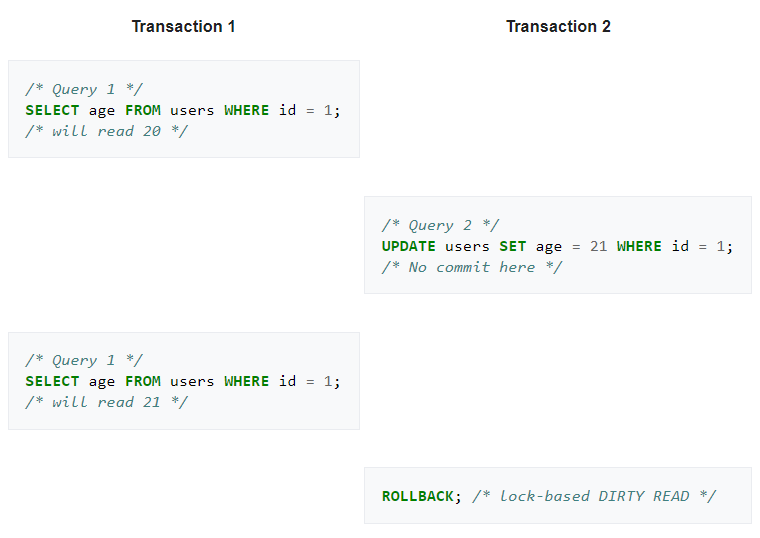
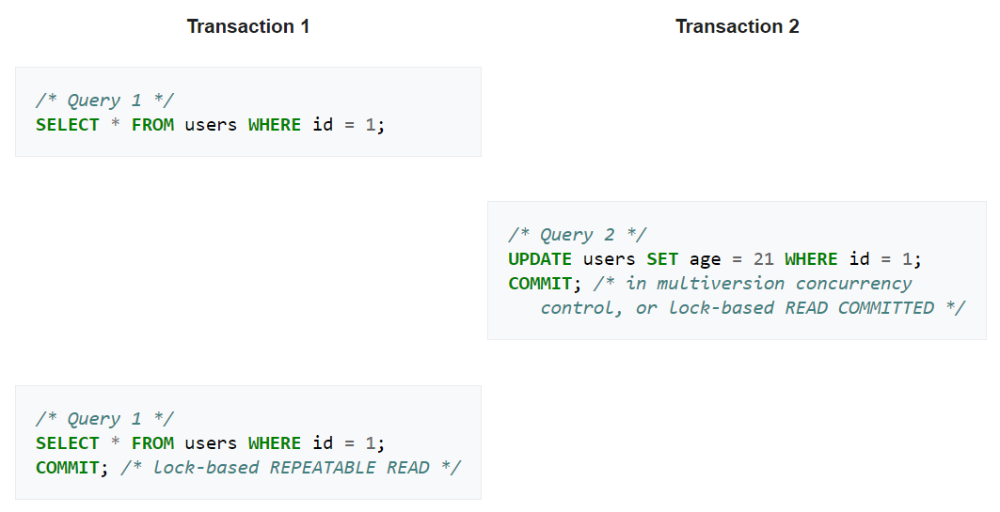
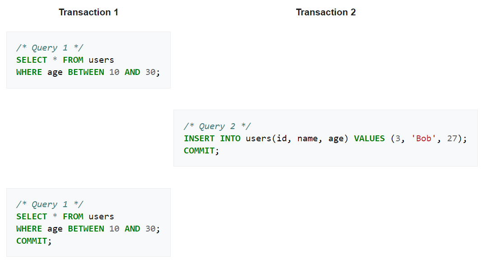

# Database

## Transaction

a unit of work performed within a Database Management System against a database, and it must be ACID (atomic, consistent, isolated & durable).

## ACID

**Atomicity**: either all occurs, or nothing occurs

**Consistency**: a transaction can only bring the database from one valid state to another (must conform to existing constraints in the database)

**Isolation**: concurrent and sequential execution of transactions produce the same result (must not affect other transactions)

**Durability**: transactions that have committed will survive permanently

## Read phenomena

### Dirty reads

A transaction reads uncommitted data that was modified by another transaction.

**Example**:

### Non-repeatable reads

During the course of a transaction, a row is retrieved twice and the values within the row differ between reads.

**Example**:

### Phantom reads

In the course of a transaction, new rows are added or removed by another transaction to the records being read.

**Example**:

## Isolation levels

### Read uncommitted

One transaction may see not-yet-committed changes made by other transactions.

### Read committed

Any data read is committed at the moment it is read.

Keep write locks (acquired on selected data) until the end of the transaction, but read locks are released as soon as the SELECT operation is performed.

### Repeatable reads

Keep read and write locks (acquired on selected data) until the end of the transaction. However, range-locks are not managed, so phantom reads can occur.

### Serializable

To be continued