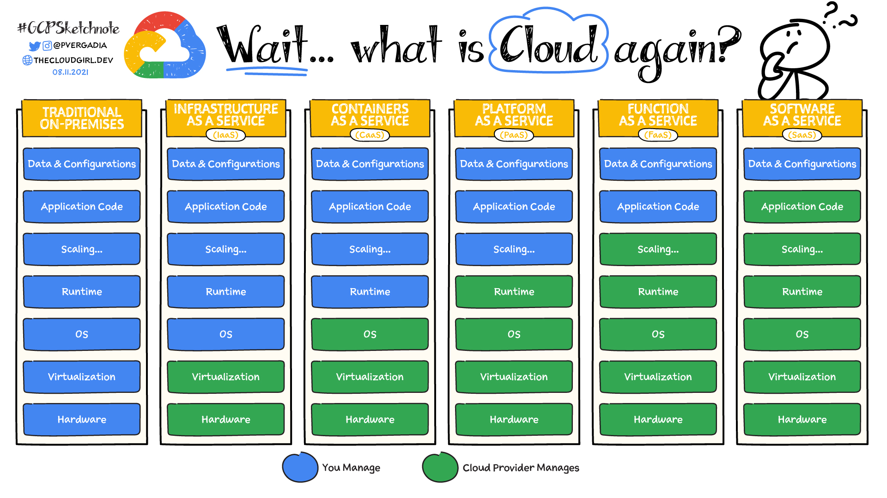

# PaaS vs. IaaS vs. SaaS vs. CaaS

* **On-premises**: If you decide to build your house from scratch, you do everything yourself. You’ll need to source the raw materials and tools, put everything together, and run to the store every time you need anything. This is similar to running an application on-premises, where you own everything from the hardware to your applications and scaling.

* **Infrastructure as a service**: If you are busy, you might consider hiring a contractor to do the work. You tell them how you want the house to look and how many rooms you want, and they take the instructions and build your home. IaaS works in a similar way for your applications. You rent the hardware to run your application on, but you are responsible for managing the OS, runtime, scale, and all the data. Example: Compute Engine

* **Containers as a service**: If buying a home is just too much work due to the maintenance it comes with, you can choose to rent instead. The basic utilities are included, but you bring your own furniture and make the space yours. With containers, you can bring a containerized application, so you don't have to worry about the underlying operating system but still have control over scale and runtime.  Example: Google Kubernetes Engine (GKE)

* **Platform as a service**: If you don’t want to worry about furnishing your living space, you can rent a furnished house. PaaS lets you bring your own code and deploy it but leaves the server management and scaling up to the cloud provider. Examples: App Engine, Cloud Run

* **Function as a service**: If you just need a small dedicated place to work away from your home, you can rent a desk in a coworking workspace. Similarly, FaaS allows you to build and deploy a small piece of code, or a function, that performs a specific task. The cloud provider adds scale if needed when a function executes. Example: Cloud Functions

* **Software as a service**: Now, imagine you move into a finished house (rented or purchased), but you have to pay for upkeep, such as cleaning or lawn care. SaaS is the same—you pay to use a complete application for a specific purpose that is managed, maintained, and secured by the cloud provider, but you are responsible for taking care of your own data. Example: Google Workspace

### Reference

https://cloud.google.com/learn/paas-vs-iaas-vs-saas#:~:text=Cloud%20computing%20has%20three%20main,(software%20as%20a%20service).