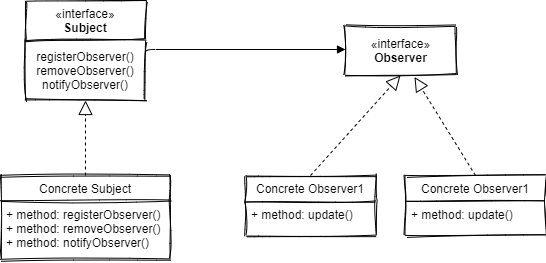

# Observer

## Class Diagram



Reference: https://coderethinked.com/wp-content/uploads/2021/01/Observer-design-pattern-1.png

## Example

```java
import java.util.ArrayList;
import java.util.List;

class Subject
{
    private List<Observer> observers = new ArrayList<Observer>();
    private int state;

    public int getState()
    { return state; }

    public void setState(int state)
    {
        this.state = state;
        notifyAllObservers();
    }

    public void attach(Observer observer)
    { observers.add(observer); }

    public void notifyAllObservers()
    {
        for (Observer observer : observers)
        { observer.update(); }
    }
}

abstract class Observer
{
    protected Subject subject;
    public abstract void update();
}

class BinaryObserver extends Observer
{
    public BinaryObserver(Subject subject)
    {
        this.subject = subject;
        this.subject.attach(this);
    }

    @Override
    public void update()
    { System.out.println( "Binary String: " + Integer.toBinaryString( subject.getState() ) ); }
}

class OctalObserver extends Observer
{
    public OctalObserver(Subject subject)
    {
        this.subject = subject;
        this.subject.attach(this);
    }

    @Override
    public void update()
    { System.out.println( "Octal String: " + Integer.toOctalString( subject.getState() ) ); }
}

class HexaObserver extends Observer
{
    public HexaObserver(Subject subject)
    {
        this.subject = subject;
        this.subject.attach(this);
    }

    @Override
    public void update()
    { System.out.println( "Hex String: " + Integer.toHexString( subject.getState() ).toUpperCase() ); }
}

public class testObserver
{
    public static void main(String[] args)
    {
        Subject subject = new Subject();

        new HexaObserver(subject);
        new OctalObserver(subject);
        new BinaryObserver(subject);

        System.out.println("First state change: 15");
        subject.setState(15);
        System.out.println();
        System.out.println("Second state change: 10");
        subject.setState(10);
    }
}
```

**Result**:
``````
First state change: 15
Hex String: F
Octal String: 17
Binary String: 1111

Second state change: 10
Hex String: A
Octal String: 12
Binary String: 1010
``````