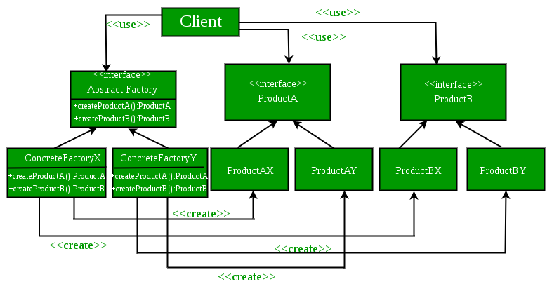

# Abstract Factory

## Class Diagram



Reference: https://media.geeksforgeeks.org/wp-content/uploads/AbstractFactoryPattern-2.png

## Example

```java
abstract class BigMac
{
    public String region;

    public String toString()
    { return "A Big Mac served in " + this.region + " is made."; }
}

class CanadianBigMac extends BigMac
{
    public CanadianBigMac()
    {
        this.region = "Canada";
        System.out.println(toString());
    }
}

class FrenchBigMac extends BigMac
{
    public FrenchBigMac()
    {
        this.region = "France";
        System.out.println(toString());
    }
}

abstract class McChicken
{
    public String region;

    public String toString()
    { return "A McChicken served in " + this.region + " is made."; }
}

class CanadianMcChicken extends McChicken
{
    public CanadianMcChicken()
    {
        this.region = "Canada";
        System.out.println(toString());
    }
}

class FrenchMcChicken extends McChicken
{
    public FrenchMcChicken()
    {
        this.region = "France";
        System.out.println(toString());
    }
}

interface McDonalds
{
    BigMac makeBigMac();
    McChicken makeMcChicken();
}

class CanadianMcDonalds implements McDonalds
{
    public BigMac makeBigMac()
    { return new CanadianBigMac(); }

    public McChicken makeMcChicken()
    { return new CanadianMcChicken(); }
}

class FrenchMcDonalds implements McDonalds
{
    public BigMac makeBigMac()
    { return new FrenchBigMac(); }

    public McChicken makeMcChicken()
    { return new FrenchMcChicken(); }
}

public class testAbstractFactory
{
    public static void main(String[] args)
    {
        McDonalds mcDonalds1 = new CanadianMcDonalds();
        BigMac bigMac1 = mcDonalds1.makeBigMac();
        McChicken mcChicken1 = mcDonalds1.makeMcChicken();

        McDonalds mcDonalds2 = new FrenchMcDonalds();
        BigMac bigMac2 = mcDonalds2.makeBigMac();
        McChicken mcChicken2 = mcDonalds2.makeMcChicken();
    }
}
```

**Result**:
``````
A Big Mac served in Canada is made.
A McChicken served in Canada is made.
A Big Mac served in France is made.
A McChicken served in France is made.
``````