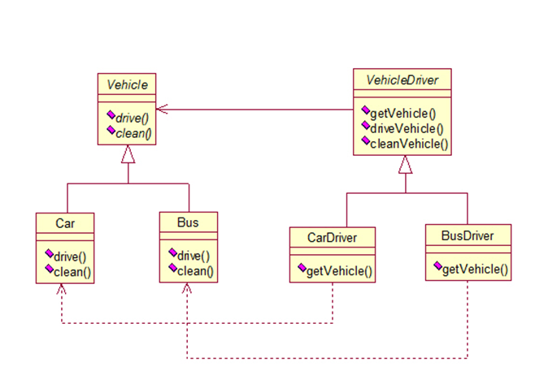

# Factory method (class-based pattern)

## Class Diagram



Reference: https://www.startertutorials.com/patterns/wp-content/uploads/2013/11/10-factory-method-realworld.png

## Example

```java
abstract class Coffee
{
    protected String type;

    public String toString()
    { return "A cup of " + this.type + " is made."; }
}

class Espresso extends Coffee
{
    public Espresso()
    {
        this.type = "Espresso";
        System.out.println(toString());
    }
}

class Cappuccino extends Coffee
{
    public Cappuccino()
    {
        this.type = "Cappuccino";
        System.out.println(toString());
    }
}

class Mocha extends Coffee
{
    public Mocha()
    {
        this.type = "Mocha";
        System.out.println(toString());
    }
}

abstract class Factory
{
    abstract public Coffee makeCoffee();
}

class EspressoFactory extends Factory
{
    @Override
    public Coffee makeCoffee()
    { return new Espresso(); }
}

class CappuccinoFactory extends Factory
{
    @Override
    public Coffee makeCoffee()
    { return new Cappuccino(); }
}

class MochaFactory extends Factory
{
    @Override
    public Coffee makeCoffee()
    { return new Mocha(); }
}

public class testFactoryMethod
{
    public static void main(String[] args)
    {
        Factory factory1 = new EspressoFactory();
        Coffee coffee1 = factory1.makeCoffee();
        Factory factory2 = new CappuccinoFactory();
        Coffee coffee2 = factory2.makeCoffee();
        Factory factory3 = new MochaFactory();
        Coffee coffee3 = factory3.makeCoffee();
    }
}
```