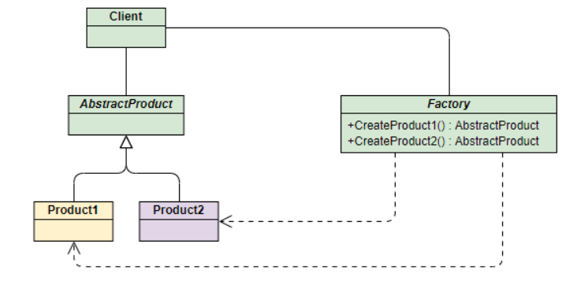

# Simple Factory

to be continued

## Class diagram



Reference: https://programmer.ink/images/think/1707e5a6bb88af55627831c01dae5fa3.jpg

## Example

```java
abstract class Pizza
{
    protected String type;
}

class VeggiePizza extends Pizza
{
    public VeggiePizza()
    {
        this.type = "Veggie Pizza";
        System.out.println("A " + this.type + " is made.");
    }
}

class CheesePizza extends Pizza
{
    public CheesePizza()
    {
        this.type = "Cheese Pizza";
        System.out.println("A " + this.type + " is made.");
    }
}

class MeatZZaPizza extends Pizza
{
    public MeatZZaPizza()
    {
        this.type = "MeatZZa Pizza";
        System.out.println("A " + this.type + " is made.");
    }
}

class SimpleFactory
{
    public static Pizza makePizza(String type)
    {
        Pizza pizza = null;
        if (type.equalsIgnoreCase("Veggie"))
            pizza = new VeggiePizza();
        else if (type.equalsIgnoreCase("Cheese"))
            pizza = new CheesePizza();
        else if (type.equalsIgnoreCase("MeatZZa"))
            pizza = new MeatZZaPizza();
        return pizza;
    }
}

public class testSimpleFactory
{
    public static void main(String[] args)
    {
        Pizza pizza1 = SimpleFactory.makePizza("veggie");
        Pizza pizza2 = SimpleFactory.makePizza("cheese");
        Pizza pizza3 = SimpleFactory.makePizza("meatzza");
    }
}
```

**Result**:

``````
A Veggie Pizza is made.
A Cheese Pizza is made.
A MeatZZa Pizza is made.
``````