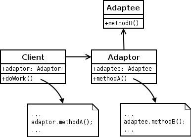
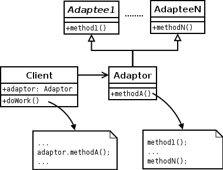

# Adapter

Allow incompatible classes to work together by converting the interface of one class into an interface expected by the clients.

## Object Adapter



Reference: https://upload.wikimedia.org/wikipedia/commons/d/d7/ObjectAdapter.png

Implement the target interface by delegating to an adaptee object at run-time (adaptee.specificOperation()).

## Class Adapter



Reference: https://upload.wikimedia.org/wikipedia/commons/3/35/ClassAdapter.png

Implement the target interface by inheriting from an adaptee class at compile-time (specificOperation()).

## Example

```java
interface LightningPhone
{
    void recharge();
    void useLightning();
}

interface MicroUsbPhone
{
    void recharge();
    void useMicroUsb();
}

class Iphone implements LightningPhone
{
    private boolean connector;

    @Override
    public void useLightning()
    {
        connector = true;
        System.out.println("Lightning connected");
    }

    @Override
    public void recharge()
    {
        if (connector) {
            System.out.println("Recharge started");
            System.out.println("Recharge finished");
        } else {
            System.out.println("Connect Lightning first");
        }
    }
}

class Android implements MicroUsbPhone
{
    private boolean connector;

    @Override
    public void useMicroUsb()
    {
        connector = true;
        System.out.println("MicroUsb connected");
    }

    @Override
    public void recharge()
    {
        if (connector) {
            System.out.println("Recharge started");
            System.out.println("Recharge finished");
        } else {
            System.out.println("Connect MicroUsb first");
        }
    }
}

/* exposing the target interface while wrapping source object */
class LightningToMicroUsbAdapter implements MicroUsbPhone
{
    private final LightningPhone lightningPhone;

    public LightningToMicroUsbAdapter(LightningPhone lightningPhone)
    {
        this.lightningPhone = lightningPhone;
    }

    @Override
    public void useMicroUsb()
    {
        System.out.println("MicroUsb connected");
        lightningPhone.useLightning();
    }

    @Override
    public void recharge()
    {
        lightningPhone.recharge();
    }
}

public class testAdapter
{
    static void rechargeMicroUsbPhone(MicroUsbPhone phone)
    {
        phone.useMicroUsb();
        phone.recharge();
    }

    static void rechargeLightningPhone(LightningPhone phone)
    {
        phone.useLightning();
        phone.recharge();
    }

    public static void main(String[] args)
    {
        Android android = new Android();
        Iphone iPhone = new Iphone();

        System.out.println("Recharging android with MicroUsb");
        rechargeMicroUsbPhone(android);
        System.out.println();

        System.out.println("Recharging iPhone with Lightning");
        rechargeLightningPhone(iPhone);
        System.out.println();

        System.out.println("Recharging iPhone with MicroUsb");
        rechargeMicroUsbPhone(new LightningToMicroUsbAdapter (iPhone));
        System.out.println();
    }
}
```

**Result**:
``````
Recharging android with MicroUsb
MicroUsb connected
Recharge started
Recharge finished

Recharging iPhone with Lightning
Lightning connected
Recharge started
Recharge finished

Recharging iPhone with MicroUsb
MicroUsb connected
Lightning connected
Recharge started
Recharge finished
``````