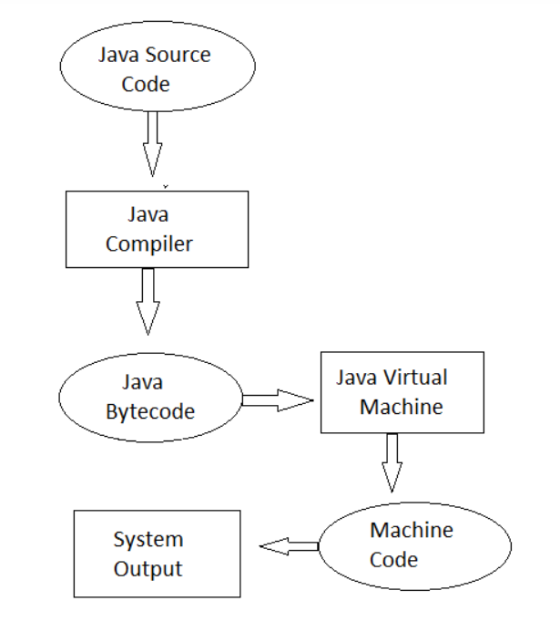

# Java Q&A

## Q1: Why is Java platform-independent?

Java compiler transforms source code into bytecode. This bytecode could run in any operating system, and the JVM in each
operating system could transform the bytecode into its own machine code which could be executed by the machine.

image reference: https://www.upgrad.com/blog/why-is-java-platform-independent-language/

## Q2: Differences between C++ and Java

1. The C++ compiler compiles and converts the source code into machine code. That's why C++ is faster than Java but not
   platform-independent ([*reference*](https://www.geeksforgeeks.org/similarities-and-difference-between-java-and-c/));

2. Java is completely object-oriented, while C++ is both object-oriented and procedural. We could define a variable or a
   method outside of a class in C++, while Java doesn't support this;

3. There is no pointer in Java;

4. Java doesn't support multiple inheritance, but allows a class to implement multiple interfaces;

5. Java provides garbage collection which frees developers from managing memory.

## Q3: Shallow copy vs Deep copy

A new object B is created, and the field values of A are copied over to B.

**shallow copy**: If the field value is a reference to an object (e.g., a memory address), it copies the reference,
hence referring to the same object as A does. And if the field value is a primitive type, it copies the value of the
primitive type.

**deep copy**: create a new instance for any referenced objects.

## Q4: Abstract class vs Interface

**Similarity**: could not be instantiated

**Differences**:

1. An interface only contains abstract methods, while an abstract class could contain non-abstract methods;

2. A class could implement multiple interfaces, while it could inherit from only one abstract class.

## Q5: JVM vs JRE vs JDK

**JVM**: Java Virtual Machine, responsible for transforming bytecode into machine code.

**JRE**: Java Runtime Environment, a package of everything necessary to run a compiled Java program which includes JVM.
It cannot be used to create new programs.

**JDK**: Java Development Kit, the full-featured SDK for Java. It has everything the JRE has, but also the compiler and
other tools. It is capable of creating and compiling programs.

Reference: https://stackoverflow.com/questions/1906445/what-is-the-difference-between-jdk-and-jre

## Q6: ArrayList vs Vector

**ArrayList** is not synchronized, while **Vector** is.

## Q7: equals() vs ==

**==** checks whether both objects point to the same memory location while **equals()** compares the values of the two
objects.

## Q8: HashMap vs HashTable

|                                               HashMap                                               |                                HashTable                                 |
|:---------------------------------------------------------------------------------------------------:|:------------------------------------------------------------------------:|
| **NOT synchronized**. It cannot be shared between many threads without proper synchronization code. | **Synchronized**. It is thread-safe and can be shared with many threads. |
|                          one null key and multiple null values are allowed                          |                     no null key or value are allowed                     |

## Q9: Contiguous memory locations are usually used for storing actual values in an array but not in ArrayList. Explain the reason

An array generally contains elements of the primitive data types such as int, float, etc. In such cases, the array
directly stores these elements at contiguous memory locations. While an ArrayList does not contain primitive data types.
An arrayList contains the reference of the objects at different memory locations instead of the object itself. That is
why the objects are not stored at contiguous memory locations.

## Q10: local variable vs instance variable

**local variable**: used inside a method, constructor, or a block and has only local scope;

**instance variable**: a variable associated with its object. These variables are declared within a class, but outside a
method. Every object of that class will create its own copy of the variables while using it. Thus, any changes made to
the variable won’t affect any other instances of that class.

## Q11: constructor vs method

|                                            constructor                                             |                  method                   |
|:--------------------------------------------------------------------------------------------------:|:-----------------------------------------:|
|                             used to initialize the state of an object                              | used to represent a behavior of an object |
|                                    do not have any return type                                     |          must have a return type          |
|            constructor name must always be the same as the class name                              |              no restriction               |

## Q12: What is Java String Pool?

Java String pool refers to a collection of Strings which are stored in **heap** memory. Whenever a new object is created, String pool first checks whether the object exists in the pool or not. If exists, then the same reference is returned to the variable else a new object will be created in the String pool and the respective reference will be returned.

## Q13: String vs StringBuilder vs StringBuffer

|     String      |   StringBuffer   |     StringBuilder      |
|:---------------:|:----------------:|:----------------------:|
| **thread-safe** | **synchronized** |  **NOT** synchronized  |
|    immutable    |     mutable      |        mutable         |

## Q14: mutable vs immutable

A **mutable** object can be changed after it was created, while an **immutable** object (like String) cannot.

## Q15: Why is String an immutable class?

## Reference: 
https://www.edureka.co/blog/interview-questions/java-interview-questions/
