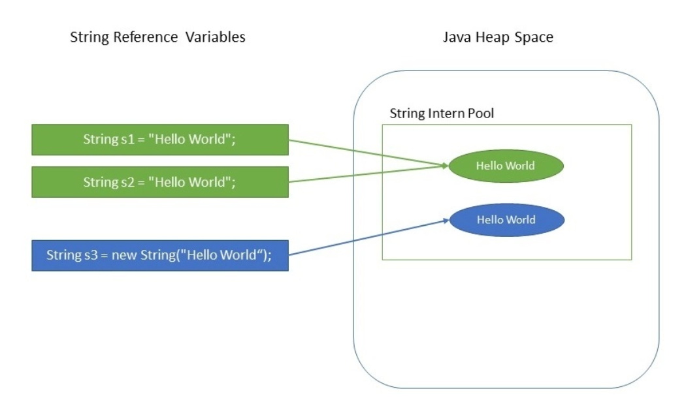

# String

Two ways of creating a String object:

```java
public class testString {
    public static void main(String[] args) {
        String a = "abc";
        String b = "abc";
        String c = new String("abc");

        System.out.println(a == b);
        System.out.println(a == c);
    }
}
```

**Result**:
```
true
false
```

**Reason**:


**Reference**:

https://www.baeldung.com/wp-content/uploads/2018/08/Why_String_Is_Immutable_In_Java.jpg